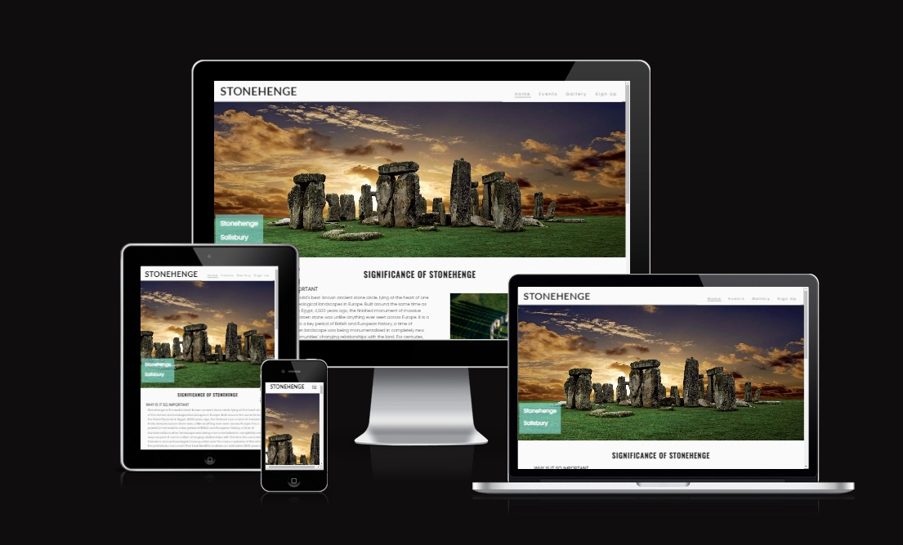
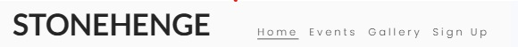
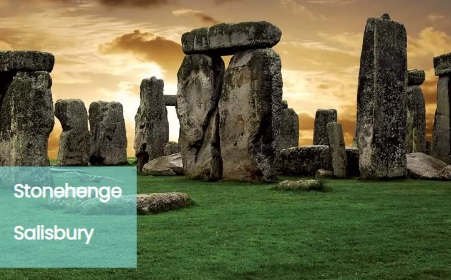
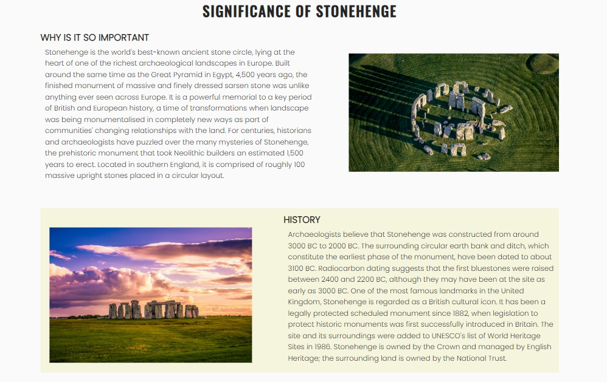
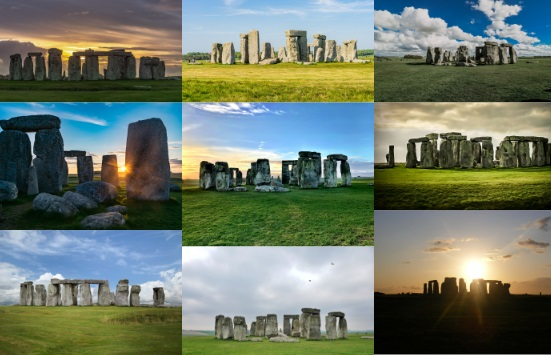
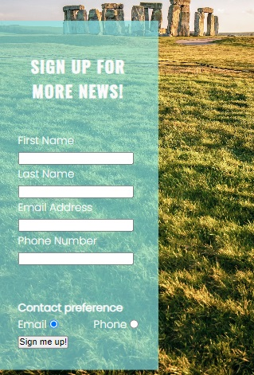
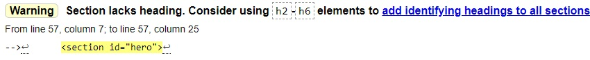

Stonehenge

## Contents

<a href="#ux>UX

# UX 
This is an informative website I've created based on Stonehenge. 
I created it to help inform viewers about general knowledge of Stonehenge and the events they hold throughout the year.
There's a gallery page for images aswell as a signup page for viewers to recieve any news updates.

# Features
__Existing Features__

 - The main page is based on general information about Stonehenge and it's history.
 - The events page is information about current events and upcoming future events.
 - The hallery page is for general pictures of Stonehenge.
 - Lastly the sign-up page is a newsfeed letter for consumers to input details and get any news and updates.

__Navigation Bar__

- Featured on all four pages, the full responsive navigation bar includes links to the Logo, Home page, Event page, Gallery and Sign Up page and is identical in each page to allow for easy navigation.
- This section will allow the user to easily navigate from page to page across all devices without having to revert back to the previous page via the ‘back’ button.

# The landing page image

- The landing includes a photograph with text overlay to allow the user to see a picture of Stonehenge and location.
- This section introduces the user to an informative site about the great conspiracy filled Stonehenge.

# Main page

In the main page there's three main sections such as 'Importance, History and Archaeology.

- Importance is general information about why Stonehenge is so important and why it is a key feature to British culture.
- History is about when Stonehenge was built and how long it took to build.
- Archaeology is about how Stonehenge was created and how even to this day it is still worked on and studied.

# The Footer

The footer section includes links to the relevant social media sites for Stonehenge on Facebook and Instagram. 
- The links will open to a new tab to allow easy navigation for the user.
- I also added a hover function that turns a light green (the same green used on my hero text box)
- The footer is valuable to the user as it encourages them to keep connected via social media

# Events page

The events page is similar to the main page as it's layout is also in three sections but flexed in rows.
- THE MYSTERY OF THE STONES - is a Sherlock themed event is a fun pop-up play, that takes place at Stonehenge Centre.
- FESTIVAL OF NEOLITHIC IDEAS - is a hands-on activity with demonstrations, talks and tours, led by experts in the field.
- STONEHENGE: UP CLOSE - is an exclusive tour around the Monument led by one of English Heritage’s experts.

# Gallery

- The gallery section is a collection of my favourite Stonehenge pictures I found in all it's glory.
- I made it to be responsive depending on screen size, from 1 picture up to four.

# The Sign Up Page

- The signup page is for any consumers to input there phone or email address so they can recieve any news updates
- Like the other pages it has been created for adaptability depending on device also.

# Features Left to Implement

I have plenty of ideas I would love to create into the website such as;
- A conspiracy page.
- More detail into the history and general information about Stonehenge.
- More social links and social media.
- A video or two on Stonehenge.
- Add an age clock near hero image on main page.

# Testing

I've tested my Stonehenge website on multiple browers such as Firefox/Chrome and Microsoft edge. Aswell as my android phone "Samsung internet".
To my current knowledge there are no bugs on any device or internet browser - although I'm still yet to test fully on an ipad/tablet.
The website is fully adaptable to all devices and screen sizes.
I believe any of my website consumers will be happy and have a great experience and achieve their goals easily.
All the links and signup page work correctly and as intended.
I did have a bug with my footer's links not opening correctly on a new page but since has been fixed.

# Validator Testing

- HTML
- No errors were returned when passing through the official W3C validator - <"https://validator.w3.org/nu/?doc=https%3A%2F%2Fjordan-finlay.github.io%2Fstone_henge%2F">
- CSS
  - No errors were found when passing through the official (Jigsaw) validator - <https://jigsaw.w3.org/css-validator/validator?uri=https%3A%2F%2Fjordan-finlay.github.io%2Fstone_henge%2Findex.html&profile=css3svg&usermedium=all&warning=1&vextwarning=&lang=en>

I am currently using "Prettier" so the W3C validator complains with trailing slashes that have "no effect".
I can remove the slashes myself but whenever I save or format my code prettier will add them back in.

# Unfixed Bugs

The only potential "bug" I currently have is a "warning" for incorrect use of headers in correct correlation. I've changed them multiple times and can't fix the issue. Although it's only a warning I'd still like to fix it correctly.

# Deployment

- The site was deployed to GitHub pages. The steps to deploy are as follows:
  - In the GitHub repository, navigate to the Settings tab
  - From the source section drop-down menu, select the Master Branch
  - Once the master branch has been selected, the page will be automatically refreshed with a detailed ribbon display to indicate the successful deployment.

The live link can be found here - <https://jordan-finlay.github.io/stone_henge/>

# Credits

I used a few different websites for information aswell as images of Stonehenge.

__Content__

- Some of the text for the Home page was taken from Wikipedia.
- Some of the text was taken from an English heritage site - <https://www.english-heritage.org.uk/visit/places/stonehenge/history-and-stories/history/research/>
- The icons in the footer were taken from [Font Awesome](https://fontawesome.com/)

__Media__

- The photos and images used on the home page, event page, gallery and sign up page are from This Open Source site - <https://unsplash.com/s/photos/stonehenge-tent>

